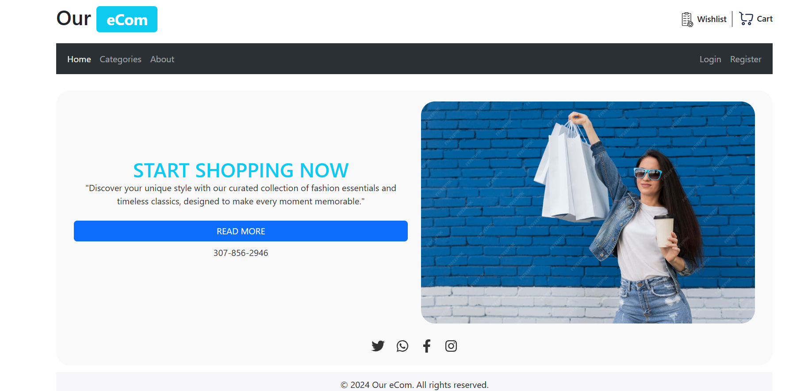
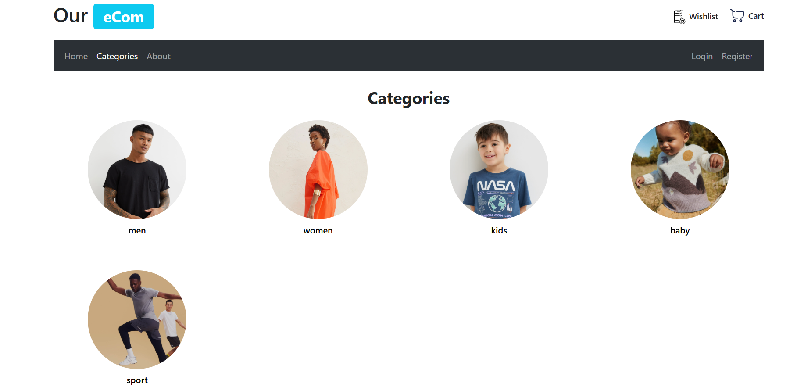
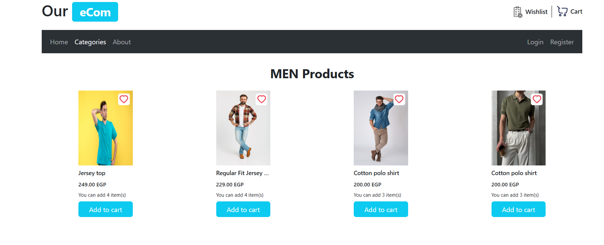
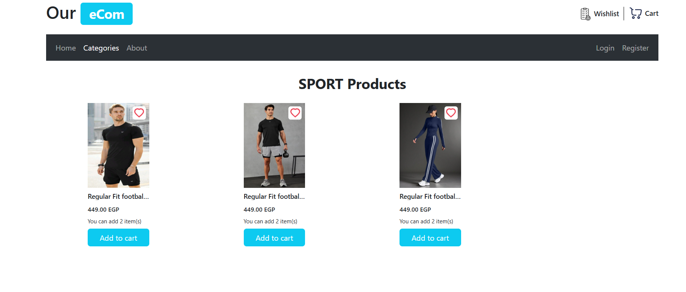
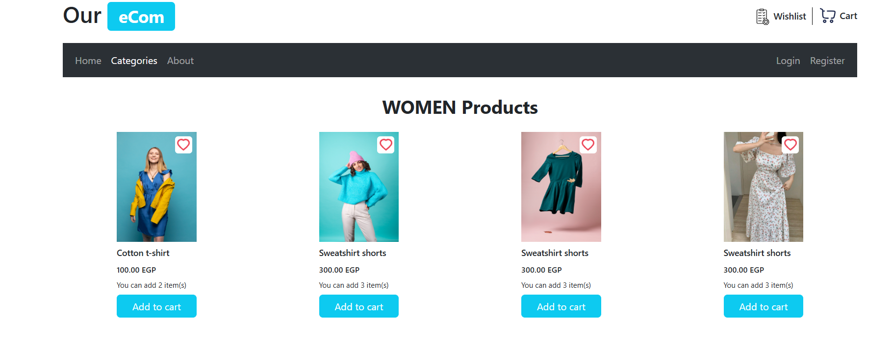
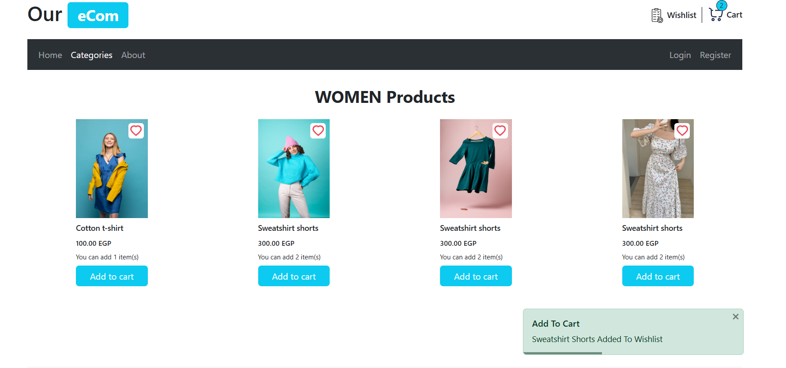
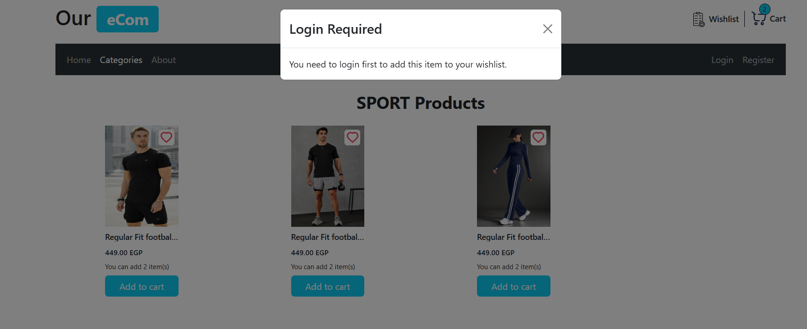
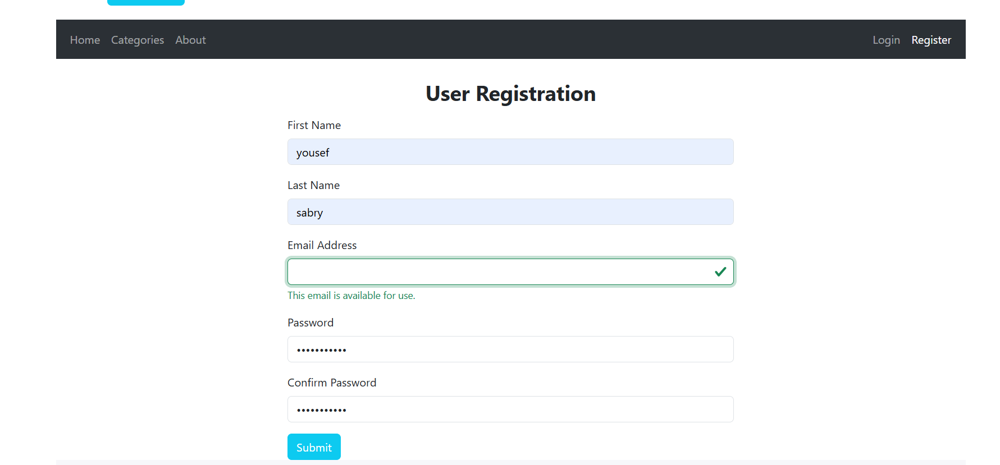
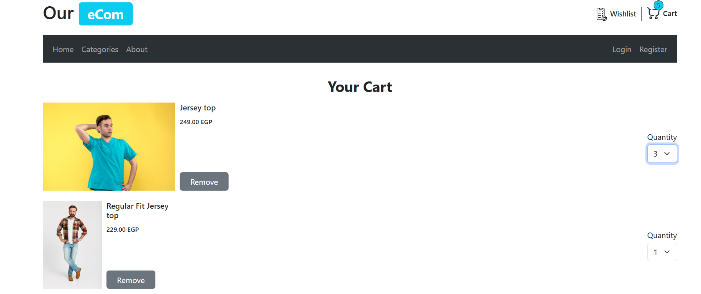
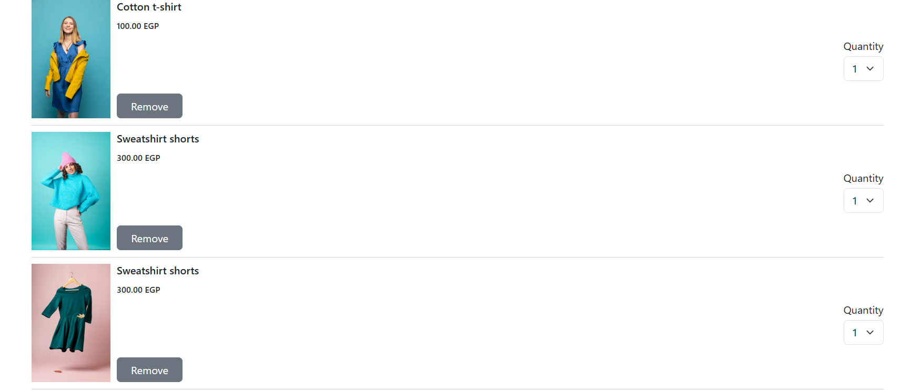

# 🛍️ Our-Ecom

An advanced **eCommerce web application** built using **React, TypeScript, and Vite**.  
This project was developed over five months, focusing on delivering a **modern, scalable, and responsive** online store experience.

---

## 📖 Overview

This eCommerce platform is designed to be **fast**, **user-friendly**, and **responsive** across all devices.  
By utilizing **TypeScript** for type safety and **Vite** for blazing-fast development, this application ensures both performance and maintainability.

---

## 🚀 Key Features

- ⚛️ Built with **React + TypeScript** for type-safe, component-based development  
- ⚡ Super-fast dev & build process using **Vite**  
- 📱 **Responsive Design** (Mobile, Tablet, Desktop)  
- 🗂️ **Category & Product Management** via `db.json` (Fake REST API using json-server)  
- 🎨 **Styled Components** & **React Bootstrap** for modular, consistent styling  
- 🔗 **React Router** for seamless navigation (Home, Products, About)  
- 🧩 **React Icons** for modern UI elements  
- ✅ Proper error handling & data validation (e.g., `Number(price)` instead of `.toFixed()` on strings)

---

## 🧠 Notes

- All data and images are **locally hosted** — no external API used  
- This project was created **for educational and portfolio purposes**  

---

## 🌐 Live Demo

🚧 [Demo Link – Coming Soon](#)

---

## 🖼️ Screenshots

### 🏠 Home Page

### 🛍️ Category Page 

### 🛒 Products Page

### 🛒 Add To Cart

### 🔐 Login Required

### 🧾 Register Page

### 💳 Cart Page

---

## 🛠️ Technologies Used

- **React**  
- **TypeScript**  
- **Vite**  
- **Styled Components**  
- **React Bootstrap**  
- **React Router**  
- **React Icons**  
- **json-server** (`db.json` as fake backend)

---

## 🌍 Deployment

This project can be deployed easily on:
- [Vercel](https://vercel.com/)
- [Netlify](https://www.netlify.com/)

---

## 👨‍💻 Developer

**Developed by:** [Yousef Sabry](https://portfolio-yousef-sabry.netlify.app)  
🎯 Frontend Developer | React.js | Machine Learning Enthusiast  

📧 **Email:** yousef.sofah123@gmail.com  
💼 **Portfolio:** [portfolio-yousef-sabry.netlify.app](https://portfolio-yousef-sabry.netlify.app)
